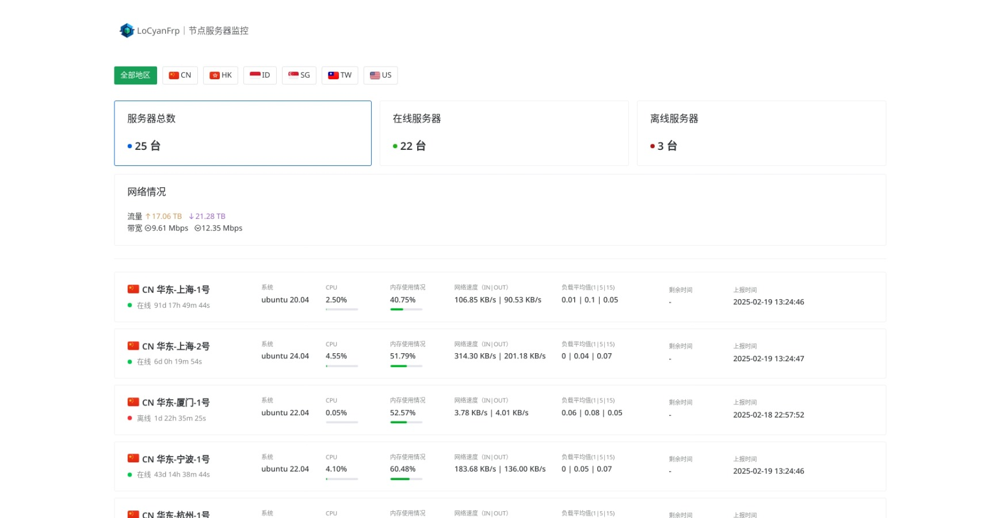

# Natsuka

一款 Akile Monitor 前端，基于 Naive UI 开发。



## 安装

```bash
git clone https://github.com/LoCyan-Team/Natsuka.git

cd Natsuka

bun install
```

## 配置文件

您可以在构建后生成的 `config.json` 中进行修改

## 构建

```bash
bun run build
```

## 开发

```bash
bun run dev
```
